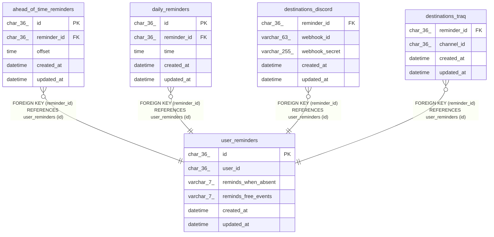

# traq_transfer

## Tables

| Name | Columns | Comment | Type |
| ---- | ------- | ------- | ---- |
| [ahead_of_time_reminders](ahead_of_time_reminders.md) | 5 |  | BASE TABLE |
| [daily_reminders](daily_reminders.md) | 5 |  | BASE TABLE |
| [destinations_discord](destinations_discord.md) | 5 |  | BASE TABLE |
| [destinations_traq](destinations_traq.md) | 4 |  | BASE TABLE |
| [user_reminders](user_reminders.md) | 6 |  | BASE TABLE |

## Relations

---

> Generated by [tbls](https://github.com/k1LoW/tbls)
