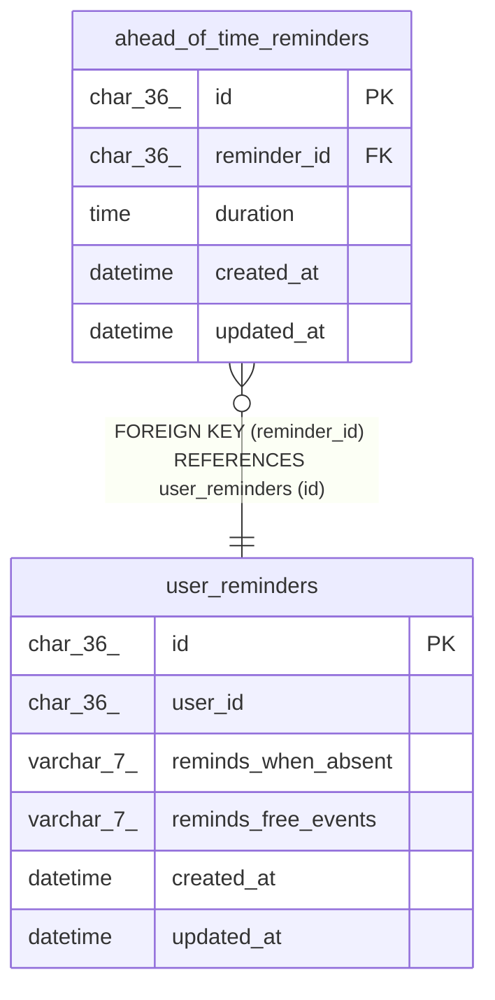

# ahead_of_time_reminders

## Description

<details>
<summary><strong>Table Definition</strong></summary>

```sql
CREATE TABLE `ahead_of_time_reminders` (
  `id` char(36) NOT NULL,
  `reminder_id` char(36) NOT NULL,
  `duration` time NOT NULL COMMENT 'Duration before the event; Seconds is ignored; 00:00:00(on time) ~ 24:00:00(before a day)',
  `created_at` datetime NOT NULL DEFAULT current_timestamp(),
  `updated_at` datetime NOT NULL DEFAULT current_timestamp() ON UPDATE current_timestamp(),
  PRIMARY KEY (`id`),
  KEY `reminder_id` (`reminder_id`),
  CONSTRAINT `ahead_of_time_reminders_ibfk_1` FOREIGN KEY (`reminder_id`) REFERENCES `user_reminders` (`id`) ON DELETE CASCADE
) ENGINE=InnoDB DEFAULT CHARSET=utf8mb4 COLLATE=utf8mb4_unicode_ci
```

</details>

## Columns

| Name | Type | Default | Nullable | Extra Definition | Children | Parents | Comment |
| ---- | ---- | ------- | -------- | ---------------- | -------- | ------- | ------- |
| id | char(36) |  | false |  |  |  |  |
| reminder_id | char(36) |  | false |  |  | [user_reminders](user_reminders.md) |  |
| duration | time |  | false |  |  |  | Duration before the event; Seconds is ignored; 00:00:00(on time) ~ 24:00:00(before a day) |
| created_at | datetime | current_timestamp() | false |  |  |  |  |
| updated_at | datetime | current_timestamp() | false | on update current_timestamp() |  |  |  |

## Constraints

| Name | Type | Definition |
| ---- | ---- | ---------- |
| ahead_of_time_reminders_ibfk_1 | FOREIGN KEY | FOREIGN KEY (reminder_id) REFERENCES user_reminders (id) |
| PRIMARY | PRIMARY KEY | PRIMARY KEY (id) |

## Indexes

| Name | Definition |
| ---- | ---------- |
| reminder_id | KEY reminder_id (reminder_id) USING BTREE |
| PRIMARY | PRIMARY KEY (id) USING BTREE |

## Relations



---

> Generated by [tbls](https://github.com/k1LoW/tbls)
