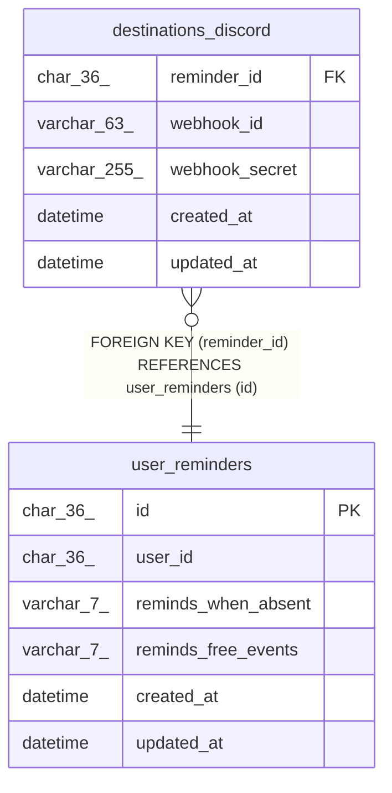

# destinations_discord

## Description

<details>
<summary><strong>Table Definition</strong></summary>

```sql
CREATE TABLE `destinations_discord` (
  `reminder_id` char(36) NOT NULL,
  `webhook_id` varchar(63) NOT NULL,
  `webhook_secret` varchar(255) NOT NULL,
  `created_at` datetime NOT NULL DEFAULT current_timestamp(),
  `updated_at` datetime NOT NULL DEFAULT current_timestamp() ON UPDATE current_timestamp(),
  UNIQUE KEY `reminder_id` (`reminder_id`,`webhook_id`),
  CONSTRAINT `destinations_discord_ibfk_1` FOREIGN KEY (`reminder_id`) REFERENCES `user_reminders` (`id`) ON DELETE CASCADE
) ENGINE=InnoDB DEFAULT CHARSET=utf8mb4 COLLATE=utf8mb4_unicode_ci
```

</details>

## Columns

| Name | Type | Default | Nullable | Extra Definition | Children | Parents | Comment |
| ---- | ---- | ------- | -------- | ---------------- | -------- | ------- | ------- |
| reminder_id | char(36) |  | false |  |  | [user_reminders](user_reminders.md) |  |
| webhook_id | varchar(63) |  | false |  |  |  |  |
| webhook_secret | varchar(255) |  | false |  |  |  |  |
| created_at | datetime | current_timestamp() | false |  |  |  |  |
| updated_at | datetime | current_timestamp() | false | on update current_timestamp() |  |  |  |

## Constraints

| Name | Type | Definition |
| ---- | ---- | ---------- |
| destinations_discord_ibfk_1 | FOREIGN KEY | FOREIGN KEY (reminder_id) REFERENCES user_reminders (id) |
| reminder_id | UNIQUE | UNIQUE KEY reminder_id (reminder_id, webhook_id) |

## Indexes

| Name | Definition |
| ---- | ---------- |
| reminder_id | UNIQUE KEY reminder_id (reminder_id, webhook_id) USING BTREE |

## Relations



---

> Generated by [tbls](https://github.com/k1LoW/tbls)
