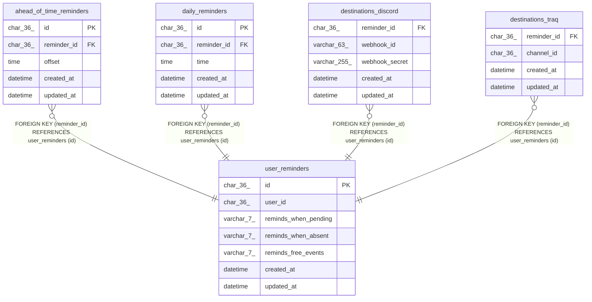

# user_reminders

## Description

<details>
<summary><strong>Table Definition</strong></summary>

```sql
CREATE TABLE `user_reminders` (
  `id` char(36) NOT NULL,
  `user_id` char(36) NOT NULL COMMENT 'traQ user uuid',
  `reminds_when_pending` varchar(7) NOT NULL DEFAULT 'daily' COMMENT 'daily to enable only daily reminders, always to enable all reminders',
  `reminds_when_absent` varchar(7) NOT NULL DEFAULT 'none' COMMENT 'none to disable, daily to enable only daily reminders, always to enable all reminders',
  `reminds_free_events` varchar(7) NOT NULL DEFAULT 'none' COMMENT 'none to disable, daily to enable only daily reminders, always to enable all reminders',
  `created_at` datetime NOT NULL DEFAULT current_timestamp(),
  `updated_at` datetime NOT NULL DEFAULT current_timestamp() ON UPDATE current_timestamp(),
  PRIMARY KEY (`id`),
  UNIQUE KEY `user_id` (`user_id`)
) ENGINE=InnoDB DEFAULT CHARSET=utf8mb4 COLLATE=utf8mb4_unicode_ci
```

</details>

## Columns

| Name | Type | Default | Nullable | Extra Definition | Children | Parents | Comment |
| ---- | ---- | ------- | -------- | ---------------- | -------- | ------- | ------- |
| id | char(36) |  | false |  | [ahead_of_time_reminders](ahead_of_time_reminders.md) [daily_reminders](daily_reminders.md) [destinations_discord](destinations_discord.md) [destinations_traq](destinations_traq.md) |  |  |
| user_id | char(36) |  | false |  |  |  | traQ user uuid |
| reminds_when_pending | varchar(7) | 'daily' | false |  |  |  | daily to enable only daily reminders, always to enable all reminders |
| reminds_when_absent | varchar(7) | 'none' | false |  |  |  | none to disable, daily to enable only daily reminders, always to enable all reminders |
| reminds_free_events | varchar(7) | 'none' | false |  |  |  | none to disable, daily to enable only daily reminders, always to enable all reminders |
| created_at | datetime | current_timestamp() | false |  |  |  |  |
| updated_at | datetime | current_timestamp() | false | on update current_timestamp() |  |  |  |

## Constraints

| Name | Type | Definition |
| ---- | ---- | ---------- |
| PRIMARY | PRIMARY KEY | PRIMARY KEY (id) |
| user_id | UNIQUE | UNIQUE KEY user_id (user_id) |

## Indexes

| Name | Definition |
| ---- | ---------- |
| PRIMARY | PRIMARY KEY (id) USING BTREE |
| user_id | UNIQUE KEY user_id (user_id) USING BTREE |

## Relations



---

> Generated by [tbls](https://github.com/k1LoW/tbls)
